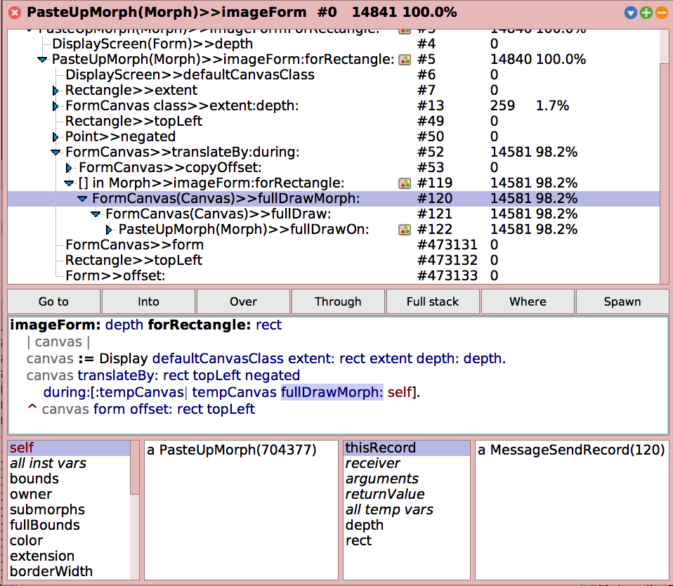

# MessageSendRecorder
Tracing tool for Squeak/Smalltalk. Includes a debugger-like browser for records.

## How to Install

```Smalltalk
Metacello new
  baseline: 'MessageSendRecorder';
  repository: 'github://hpi-swa/MessageSendRecorder:master/packages';
  load.
```

## How to Use

In general, you have to set up a `MessageSendRecorder` with an instance of `MessageSend` to then `#record` a tree (or trace) of sends, which you can `#browse`. The methods you watch define the granularity of the tree the recorder records.

For example, you can watch all methods in the *Morphic* and *Graphics* package to then record all sends involved for drawing the current world:

```Smalltalk
recorder := MessageSendRecorder new
  watchPackageNamed: #Graphics;
  watchPackageNamed: #Morphic;
  setMessageSend: (MessageSend receiver: Project current world selector: #imageForm);
  yourself.
```

You can then record and browse the results:

```Smalltalk
recorder record.
recorder topRecord browse.
```

You can also record the duration of each call, which can then be used to post-process the recording with additional information such as ration or time-to-run in milliseconds:

```Smalltalk
recorder record: #duration.
recorder collectTimeRatio. "post-record processing"
recorder collectTimeToRun. "post-record processing"
recorder topRecord browse.
```

The record browser looks like a debugger because it shows similar information:



## How to Record More Data

You can configure the recorder with before/after blocks to write more information into the records such as argument classes and return values. Any extra information is stored in `MessageSendRecordExtension`, which can dynamically add missing instance variables.

```Smalltalk
recorder
  setBefore: { [:record :rcvr :args | record extension receiverObject: rcvr ] }
  after: { [:record :rcvr :args :result | record extension returnValue: result ] }.
```

*Beware of resource-intensive operations such as full object copies!*

## How to Re-record Data

You can run the recorder multiple times to, for example, record extra information only later on. The recorder will complain with a `MsrRecordNotFound` exception if the sends do not match the initial recording and hence indicate non-deterministic behavior.

```Smalltalk
recorder record. "initial recording"
recorder record: #duration. "additional run"
```

Note that the `MsrRandumNumberWrapper` will provide a fixed seed and thus a deterministic way to re-record behavior that uses random numbers.

### How to Re-record Data for a Specific Send

It is possible to just record critical information - such as full copies of arguments - for a specific send. After the initial recording, you can do that for any record in the tree:

```Smalltalk
recorder record.
"..."
recorder recordInto: aRecord before: "..." after: "..."
```

Note that that record must be reachable from the recorder's `topRecord`.

## How to Start Recording for a Specific Receiver

It is possible to use a helper wrapper to then start the recording when that helper is triggered:

```Smalltalk
recorder recordSend: #openInWorld to: myMorph.
```

Note that the recorder needs to be configured as mentioned above. If that send is never triggered, method wrappers may lay around in your Squeak image.

There are examples in this project that `#recordNextKeyStroke` or `#recordNextMouseUp` to learn more about Morphic event handling. :smile:

## Related Work

 * Vasily Kirilichev, Eric Seckler, Benjamin Siegmund, Michael Perscheid, and Robert Hirschfeld. *Stepwise Back-in-time Debugging*. In Proceedings of GI Informatiktage 2014, Potsdam, Germany, March 27-28, 2014, GI.
 * Michael Perscheid, Tim Felgentreff, and Robert Hirschfeld. *Follow the Path: Debugging State Anomalies Along Execution Histories*. In Proceedings of the IEEE European Conference on Software Maintenance and Reengineering and the Working Conference on Reverse Engineering (CSMR-WCRE) 2014 Software Evolution Week, pages 124-133, Antwerp, Belgium, February 3-6, 2014, IEEE.
 * Michael Perscheid, Michael Haupt, Robert Hirschfeld, and Hidehiko Masuhara. *Test-driven Fault Navigation for Debugging Reproducible Failures*. In Journal of the Japan Society for Software Science and Technology (JSSST) on Computer Software, vol. 29, no. 3, pages 188-211, 2012, Japan.
 * Michael Haupt, Michael Perscheid, and Robert Hirschfeld. *Type Harvesting: A Practical Approach to Obtaining Typing Information in Dynamic Programming Languages*. In Proceedings of the Object-oriented Programming Languages and Systems (OOPS) Track of the ACM Symposium on Applied Computing (SAC) 2011, pages 1282-1289, Tunghai University, TaiChung, Taiwan, March 21-24, 2011, ACM Press.
 * Michael Perscheid, Bastian Steinert, Robert Hirschfeld, Felix Geller, and Michael Haupt. *Immediacy through Interactivity: Online Analysis of Run-time Behavior*. In Proceedings of the 17th Working Conference on Reverse Engineerings (WCRE) 2010, pages 77-86, Beverly, Massachusetts, USA, October 13-16, 2010, IEEE.
 * Bastian Steinert, Michael Haupt, Robert Krahn, and Robert Hirschfeld. *Continuous Selective Testing*. In Proceedings of the International Conference on Agile Software Development (XP) 2010, Springer LNBIP 48, pages 132-146, Trondheim, Norway, June 1-4, 2010, Springer.
 * Bastian Steinert, Michael Perscheid, Martin Beck, Jens Lincke, and Robert Hirschfeld. *Debugging into Examples: Leveraging Tests for Program Comprehension*. In Proceedings of the International Conference on Testing of Software and Communication Systems and the International Workshop on Formal Approaches to Testing of Software (TESTCOM/FATES) 2009, Springer LNCS 5826, pages 235-240, Eindhoven, Netherlands, November 2-4, 2009, Springer
